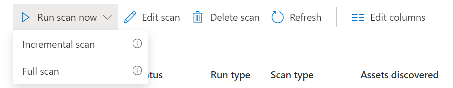
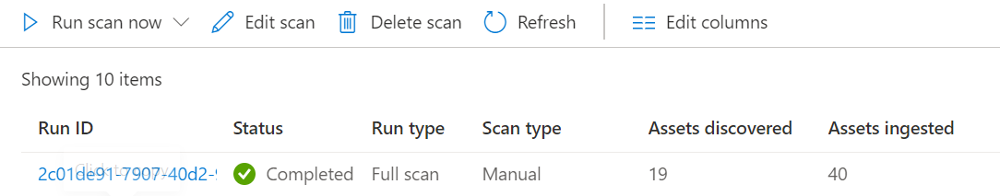

## Power BI cross tenancy set up in Purview

## Instructions

The following instructions are targeted for the organizations who have the following scenario

- Purview Account set up in tenancy A.
- Power BI set up in tenancy B.

Power BI data source will be set in the root level in Purview

## Requirements

- Postman.
- Power BI Admin rights in tenancy B.
- Purview Admin rights in tenancy A.
- User must have access to create AD Security Groups in tenancy B.

## App Registration (Tenancy B)

1.Logging to your Azure Portal where your Power BI is part of. (Tenancy B).
  
**IMPORTANT** Make sure you are able to create a service principle and AD Security Group

2.Create a new App registration under Azure Active Directory.

 

Note please make sure you fill the Redirect URIs with <https://app.powerbi.com/home?refreshAccessToken=true>

3.Once the App is register check on Authentication and make sure the ID Token has been selected and allow public client flow to set to Yes

 

Click on Save

4.Generate a new client secret. Make sure you save the value, this value is required for later on

5.Go to API Permission and make sure you grand following access to the App

 

## Create an AD Security Group (Tenancy B)

1. Create a new security group in your Azure Active Directory (Tenancy B)
2. Select Security as the Group Type.
3. Add your new App to this security group. Select Members, then select + Add members.
4. You should see a success notification showing you that it was added.

## Power BI Admin set up

Log into the Power BI tenancy that you want to register in Purview. In this case tenancy B.

1.Select the Tenant settings page.

**IMPORTANT** You need to be a Power BI Admin to see the tenant settings page.

2.Select Admin API settings > Allow service principals to use read-only Power BI admin APIs. Add the security group you created in the previous section.

 

3.Enable Enhance admin APIs responses with detailed metadata (Preview) for the security group.

4.Enhance admin APIs responses with DAX and mashup expressions (Preview) for the security group.

## Purview set up (Tenancy A)

### Service Principle

1. Create a new service principle, make sure you create a secret token and save the value of the secret. You will need it when you use the API

2. Grant following permission to the new service principle in your Purview account.

- Collection Admin
- Data Source Admin
- Data Curators

3. Construct tenant-specific sign-in URL for your service principal by running the following url in your web browser:

        https://login.microsoftonline.com/<purview_tenancy_id>/oauth2/v2.0/authorize?client_id=<client_id>&scope=openid&response_type=id_token&response_mode=fragment&state=1234&nonce=67890

Replace:

**<purview_tenant_id>** from the tenancy A.

**<client_id>**  from the Service Principle in Tenancy B

Sign-in using any non-admin account from tenancy A. This is required to provision your service principal in the foreign tenant.

When prompted, accept permission requested for View your basic profile and Maintain access to data you have given it access to.

### API Call using Postman

1.You require to get the authorisation token for your Purview account, use the following POST CALL to get the bearer token. <https://login.microsoftonline.com/{your-tenant-id}/oauth2/token>

For further information check <https://docs.microsoft.com/en-us/azure/purview/tutorial-using-rest-apis#get-token>

2.Create Power BI Data Source using PUT call.

      <https://{nameofthePurviewaccount}.purview.azure.com/scan/datasources/{PowerBIDataSourceName}?api-version=2018-12-01-preview

User following values for the Headers.

    Authorization = Bearer {Authorisationtoken}
    Content-Type =  application/json
    Accept = */*

For the body, please use the following json definition.

            {
          "kind": "PowerBI",
          "name": "PowerBIConnector",
          "authenticationType": "PowerBIDelegated",
          "properties": {
            "tenant": "{from tenancy B}",
            "ServicePrincipalKey": "{from tenancy B}",
            "clientId": "{from tenancy B}",
             "collection": {
             "type": "CollectionReference",
            "referenceName": "{Name of Purview account tenancy A}"
            }
          }
        }

3.Once the call is sent, refresh your Purview and you should see the data source under the data map.

4.Go back to Purview and grant permission to the Service Principle from Tenancy B to Purview.
This service principle requires Collection Admin and Data Source Admin access at the root level.

5.We are now going to create the scan call using the PUT call  

    <https://{PurviewaccountName}.purview.azure.com/scan/datasources/{PowerBIDataSourceName}/scans/PowerBIScan?api-version=2018-12-01-preview

User following values for the Headers

    Authorization = Bearer {Authorisation token}
    Content-Type =  application/json

 For the body, please use the following json definition

        {
          "properties": {
            "tenant": "{from tenancy B}",
            "clientId": "{from tenancy B}",
            "userName": "{Power BI tenancy B admin user}",
            "password": "{Power BI tenancy B admin user password}",
            "collection": {
              "type": "CollectionReference",
              "referenceName": "{Purview account name tenancy A}"
            }
          },
          "kind": "PowerBIDelegated",
          "id": "scan1",
          "name": "PowerBI"
        
        }

**IMPORTANT** Make sure the username used in the API Call is also added as collection admin, data source admin at the root level.

Go to Purview and check if a scan was created.

### Test

1.Go to the scan created before, in my case it is called PowerBIScan. Click on the scan and select full scan.

2.Once the Scan complete, you should be able to see Assets discovered and ingested.

3.Search for Power BI reports, you should be able to see all the assets scanned.

